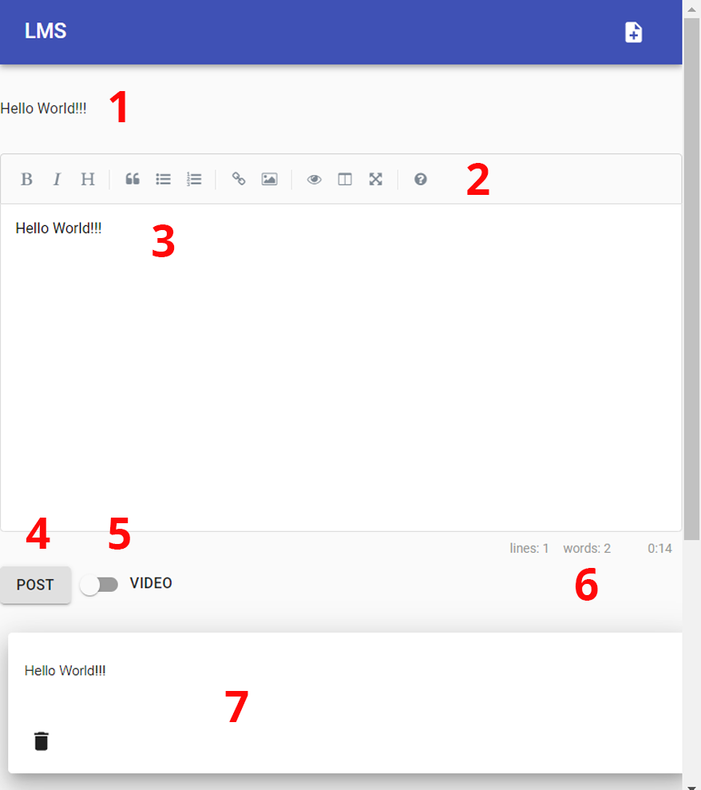

# Class Feed

1 - Preview

2 - Tool Bar

3 - Editor

4 - Post Button

5 - Video button \(if videos exist\)

6 - Status

7 - Class Feed

#### 1 - Preview

#### 2 - Tool Bar

#### 3 - Editor

#### 4 - Post Button

#### 5 - Video button \(if videos exist\)

#### 6 - Status

#### 7 - Class Feed

