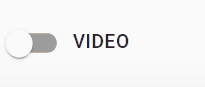

# Class Feed

1 - Preview

2 - Tool Bar

3 - Editor

4 - Post Button

5 - Video button \(if videos exist\)

6 - Status

7 - Class Feed

#### 1 - Preview

Show the preview of post currently working on.

#### 2 - Tool Bar

1 - Bold Text \(Ctrl + B\)

2 - Italic Text \(Ctrl + I\) 

3 - Headings \(Ctrl + H\)

4 - Quotes \(Ctrl + '\)

5 - Generic List \(Ctrl + L\)

6 - Numbered List \(Ctrl + Alt +L\)

7 - Create Link \(Ctrl + K\)

8 - Insert Images \(Ctrl + Alt + I\)

9 - Toggle Preview \(Ctrl + P\)

10 - Toggle Side by Side \(F9\)

11 - Toggle Fullscreen \(F11\)

12 - Markdown Guide

#### 3 - Editor

This is the place where you make your post

#### 4 - Post Button

Click when you are done finishing the Post

#### 5 - Video button \(if videos exist\)

If you are including videos on the post click here to make sure they are on the post. Otherwise they will be shown as link only.

#### 6 - Status

#### 7 - Class Feed

